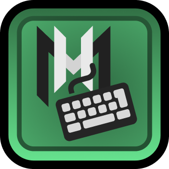

   
   <h3 align="center">Mega Hack Rebind</h3>
   

      Finally rebind Mega Hack keys!
   

## About
Wanted to rebind the Mega Hack open key, but realized that it always uses Tab?
This simple mod allows you to configure a custom keybind using Custom Keybinds.

Navigate to "Keybinds" in the settings menu and set any key you want.

This mod is compatible with Mega Hack v8, and should work across updates
thanks to signature scanning.
If any MH update breaks this mod, it will be automatically disabled.
(Notify me on Discord if this happens: `@prevter`)

## License
This project is licensed under the MIT License - see the [LICENSE.md](LICENSE.md) file for details.